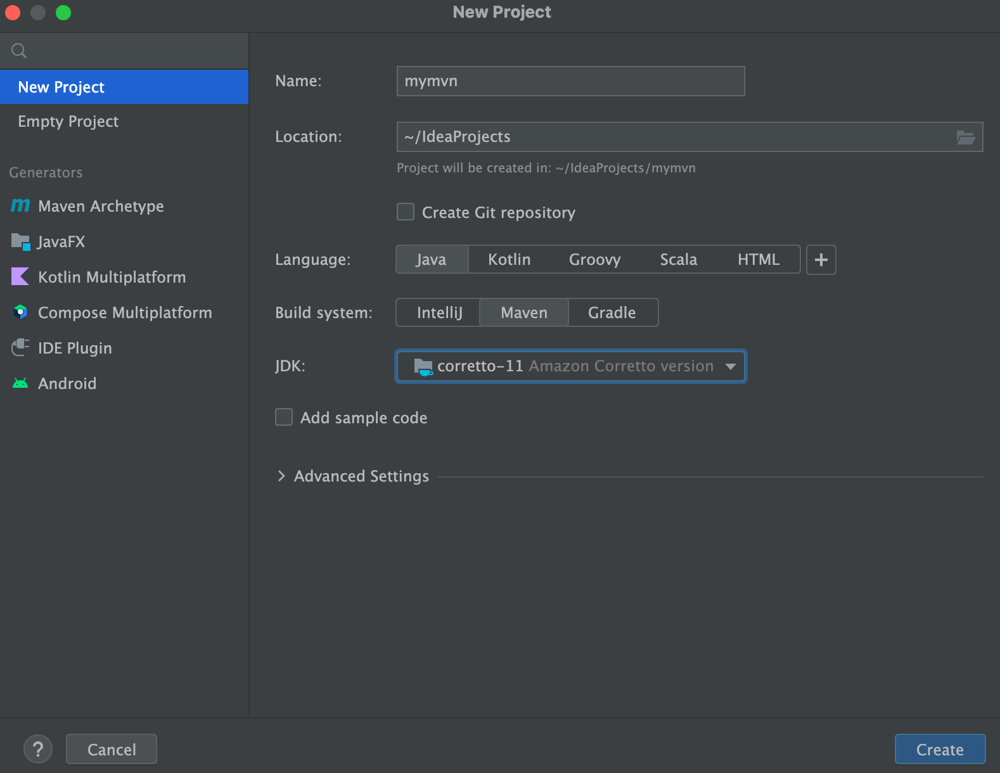

## Как создать Maven-проект в IDEA?
Открываете IDEA и выбираете New Project:

Screenshot 2023-01-15 at 14 35 55

В открывшемся окне выбираете:

слева New Project
в поле Name заполняете название вашего проекта (лучше всего латиницей, не начиная название с цифры, без пробелов, кавычек, дефисов и тп)
в Location выбираете папку в которой будет создана папка проекта
в Language выбираете Java
в Build System выбиратее Maven
в JDK открываете список и выбираете Download JDK (или сразу 11ю джаву если она уже установлена и отображается в списке)
image

Нажимаем на кнопку Create для создания проекта

## Схема Maven-проекта
Общая схема вашего pom.xml-файла:

<?xml version="1.0" encoding="UTF-8"?>
<project xmlns="http://maven.apache.org/POM/4.0.0"
xmlns:xsi="http://www.w3.org/2001/XMLSchema-instance"
xsi:schemaLocation="http://maven.apache.org/POM/4.0.0 http://maven.apache.org/xsd/maven-4.0.0.xsd">
<modelVersion>4.0.0</modelVersion>

<groupId>ru.netology</groupId>
<artifactId>НАЗВАНИЕ-ВАШЕГО-ПРОЕКТА-БЕЗ-ПРОБЕЛОВ</artifactId>
<version>1.0-SNAPSHOT</version>

  <properties>
      <maven.compiler.source>11</maven.compiler.source>
      <maven.compiler.target>11</maven.compiler.target>
      <project.build.sourceEncoding>UTF-8</project.build.sourceEncoding>
  </properties>

  <dependencies>
      <dependency>
          ...
      </dependency>
      ...
  </dependencies>

  <build>
      <plugins>
          <plugin>
            ...
          </plugin>

          <plugin>
            ...
            <executions>
              <execution>
                ...
              </execution>
              ...
            </executions>
          </plugin>
          ...
      </plugins>
  </build>

</project>
JUnit
Обратите внимание, что у артефакта нет -api на конце. Если у вас автоматически добавилась зависимость вида <artifactId>junit-jupiter-api</artifactId>, то лучше поменять артефакт на тот, что ниже, иначе будут сюрпризы в работе.

        <dependency>
            <groupId>org.junit.jupiter</groupId>
            <artifactId>junit-jupiter</artifactId>
            <version>5.7.0</version>
            <scope>test</scope>
        </dependency>
Surefire
Без этого плагина тесты могут Мавеном не запускаться, хоть в идее через кнопки они и будут проходить. Чтобы лишний раз убедиться, что всё работает, нажмите Ctrl+Ctrl и затем mvn clean test.

            <plugin>
                <groupId>org.apache.maven.plugins</groupId>
                <artifactId>maven-surefire-plugin</artifactId>
                <version>2.22.2</version>
                <configuration>
                    <failIfNoTests>true</failIfNoTests>
                </configuration>
            </plugin>
Не забудьте, что имена тест-классов должны оканчиваться на слово Test.